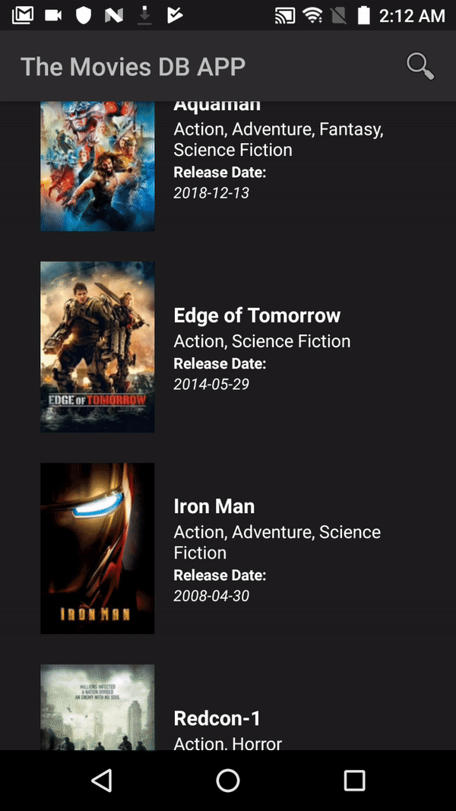
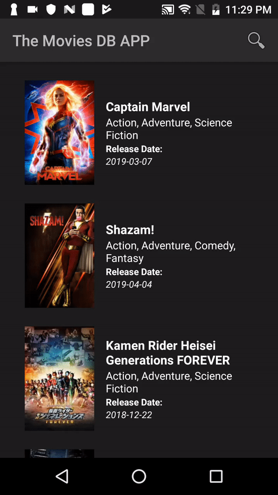

# The Movies DB APP
Teste Github Actions #8

## Simple app that consuming [TMDB Api](https://www.themoviedb.org/documentation/api)

[The Movie DB Android App - APK DOWNLOAD](https://drive.google.com/file/d/1zSfGmUcb6mwofGP69O7-STsobGTsPn3Q/view?usp=sharing)

### Main features:
- List Movies
- Pagination on Movie List
- Push to refresh movie list 
- Search Movies
- Movie Details

### The Project 

- Using [Kotlin Programming Language](https://kotlinlang.org/)
- Using [Model-View-ViewModel - MVVM](https://www.toptal.com/android/android-apps-mvvm-with-clean-architecture) Architecture to separate my view of the business logic 
- Communications between View <-> ViewModel are made using DataBinding and LiveData.
- Avoiding lost data when configurations changes. 

#### Third-party Libraries
- [Android Support Library](https://developer.android.com/topic/libraries/support-library/index.html): Library for basic project structure and compatibility, used in almost any Android Project.
- [Material Design for Android](https://developer.android.com/guide/topics/ui/look-and-feel?hl=pt-BR)
- [Glide](https://github.com/bumptech/glide) library to download and cache images.
- [Retrofit](https://square.github.io/retrofit/) library to create interfaces with MarvelApi.
- [Gson](https://github.com/google/gson) library to make TMDB Api json response parse.
- [RxJava](https://github.com/ReactiveX/RxJava) and [RxAndroid](https://github.com/ReactiveX/RxAndroid): Allows the use of [reactive extensions](http://reactivex.io/) in Android applications, allowing simplified multitasking but also powerful observable chains.
- [Okhttp](https://github.com/square/okhttp) An HTTP+HTTP/2 client for Android , used to intercept requests, manage responses, create a mock web server and more .
- [junit](https://junit.org/junit5/) To create unit tests 
- [Espresso](https://developer.android.com/training/testing/espresso) To create integration tests  
- [Mockito](https://github.com/mockito/mockito) library to mock classes on tests.

### Tools and Build

This project was built using Android Studio 3.4. To edit this project, is recomended to use the *Import Project* from Android Studio.
The application can also be built using command line. In a machine with Java 8 or newer installed and configured, checkout the root project and run `gradlew assembleDebug`. The resulting APK can be found in `project/app/build/outputs/apk/prod/debug/app-prod-debug.apk`.

#### Build variants
Use the Android Studio *Build Variants* button to choose between **prodDebug** or **prodRelease** flavors to use project consuming the real api .

If you wish run tests should choose **mockdebug** build variant . 

## Screens

 Listing movies             |  Movie details             | Searching Movie        | Updating Movie List                   
:-------------------------:|:-------------------------:|:-------------------------:|:-------------------------:
  |      |     |    

© Denis Vieira Rufino
